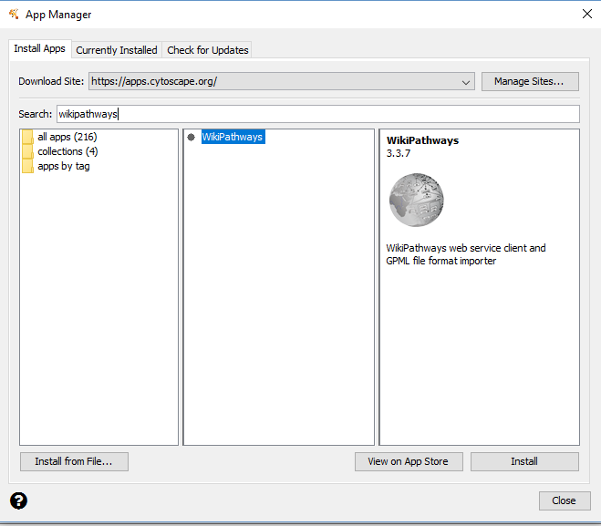
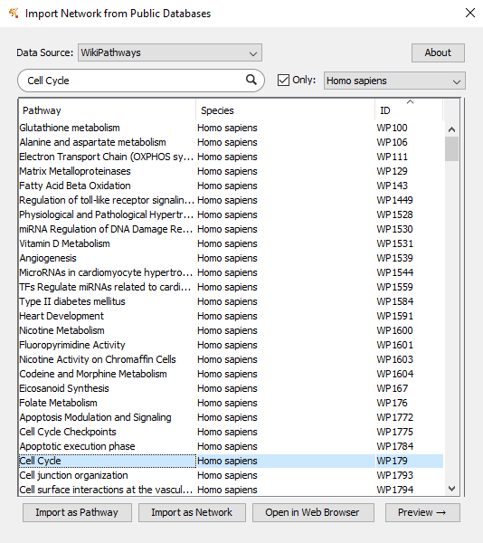
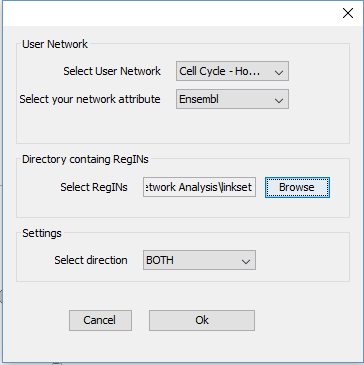
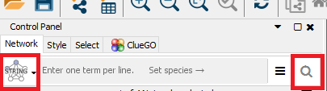
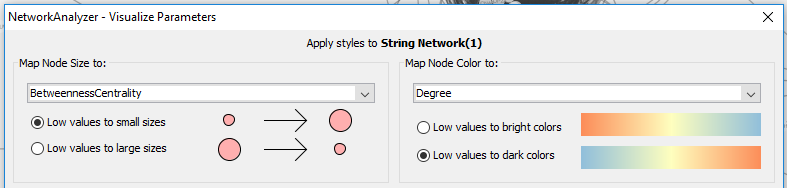

# Network Analysis
# Using network analysis to study the molecular and regulatory mechanisms involved in lung cancer
===============================================================================

January, 2021

## Practical prepared by: Dr. Martina Summer-Kutmon and Dr. Lauren Dupuis
---------------------------------------------------------------------------------------------------

In this part, we want to show you different ways of how you can build biological network relevant for a biological research topic. 
Cytoscape has a lot more functionality and you are free to explore other apps in the project if you want to.  

### Assignment 1: Drug targets in the cell cycle pathway

Using the cell cycle pathway, you will learn how pathways can be used as a resource for network biology. Besides looking at the network 
structure, we will also add drug-target information to see which drugs in the DrugBank database are known to target genes in the cell 
cycle pathway.

Before beginning, make sure the WikiPathways App is installed. Click “Apps” - “App Manager”. Search for WikiPathways and click “Install”. 
Do the same for “stringApp”.

Now we can begin by importing the Cell Cycle Pathway as a network.
•	Go to “File - Import - Network From Public Databases”
•	A dialog box will appear. Change the Data Source dropdown box to “WikiPathways”. Search for “Cell Cycle”. Click the check box for 
“Only:”, and choose “Homo sapiens” in the dropdown box. 
•	Select “Cell Cycle” from the list and click “Import as Network”

•	You should now see a network with 164 nodes and 223 edges.

> Some nodes may not be connected, so you could see subnetworks or unconnected nodes. 

Now we are going to investigate which drugs are known to target the proteins in this pathway.
You can download the Drugbank linkset to extend the network with from [here](https://ndownloader.figshare.com/files/21623682?private_link=32aae0822ffdd1f5660b). If you want to download other linksets, you can find them [here](https://cytargetlinker.github.io/pages/linksets.html).
Download and unzip the linkset.
•	Go to “Apps → CyTargetLinker → Extend network”
•	Fill in the following settings: 

Choose only the file that contains the linkset. When you click OK a dialog box appears where you can check which linkset you want to add

•	Now the known drugs from DrugBank have been added – information about drug name, drug category or approval status can be found in the 
node table.
•	If you go to “Apps → CyTargetLinker → Show Result Panel”, you can see how many drugs were added (on the right side of the screen). 
You can find more information about the drugs on the [DrugBank website](www.drugbank.ca) to investigate if any of the drugs are used 
for lung cancer treatment.  The identifiers and names of the drugs can be found in the node table below the network. 

> You can observe which genes are targeted by many drugs.

----------------------------------------------------------------------------------------------------------------------

### Assignment 2: Build network for up-regulated lung cancer genes

#### **Step 1: Gene selection**
•	Open the dataset (comp_LungCancer-Normal.txt) in Excel. 
•	Select the significantly up-regulated genes with a log2FC > 1 → filter the table by log2FC (>1) and the adju.P.Value (< 0.05). 
•	Copy the Ensembl IDs of the 408 genes.
#### **Step 2: Create PPI network for gene selection**
•	In Cytoscape, go to the Control Panel and select the STRING protein query (drop-down box left to search field) and paste the 408 gene 
names in the query field 

•	Click on the search icon.
•	Cytoscape will create a network with 368 nodes and 1,678 edges

> Notice that not all nodes are connected.

•	Select the largest connected subnetwork (click shift and select the area of the subnetwork with the computer mouse). Go to File - 
New Network - From selected nodes, all edges.
•	A new network will be created only containing the largest connected subnetwork with 244 nodes and 1,665 edges.

#### **Step 2: Investigate the network properties of the network**
•	Go to “Tools → Network Analyzer → Network Analysis → Analyze Network...”
o	The network should be treated as an undirected network (protein-protein interactions, in general, do not have a direction)
•	This tool will calculate all network properties like degree and betweenness for you.

> Look at the “Node degree” and “Node betweenness” tab in Results panel of the Network Analyzer. How are node degree 
> and betweenness distributed in this network? Do the distributions make sense? Are there any interesting observations?

#### **Step 3: Create visualization to show disease score and degree**
•	In the NetworkAnalyzer result dialog, click on “Visualize Parameters”. Select the node degree as node color gradient (Map node color 
to → Select “Degree”) and the node betweenness as node size.

> Take a look at the overall network visualization. Large nodes have a high betweenness and the redder the node, the higher 
> the degree.

> Columns in Cytoscape are sortable by clicking on the header. Take a look to see any hub nodes.
> CCNA2 has highest degree. 

#### **Step 4: Find more information about major hub gene**
There is one gene attracting attention due to a very high degree and betweenness (Question 9c). The human protein atlas is an exceptional 
resource to find out more information about the expression of a gene/protein in different tissues but it also provides detailed pathology 
analysis for relevant cancer genes. 
•	Go to the [protein atlas](https://www.proteinatlas.org) 
•	Search for CCNA2 - hub gene of our previous network
•	In the pathology tab, you can find information about the prognostic summary for different cancers, the RNA expression overview using 
data from TCGA, and show staining of the protein in different samples. 

